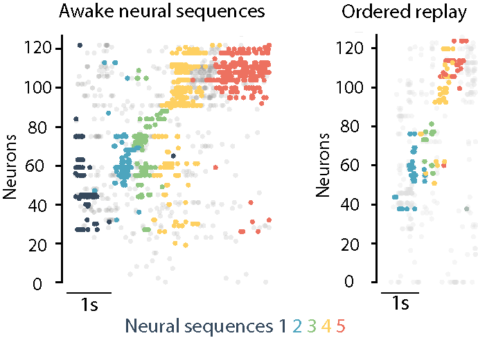

# Replay of Procedural Experience is Independent of the Hippocampus

This repository contains the code and data necessary to reproduce the figures from our publication: [Replay of Procedural Experience is Independent of the Hippocampus](https://www.biorxiv.org/content/10.1101/2024.06.05.597547v1.full.pdf).


---------------------------------------------------------------------------------------------------------

## Overview

This repository includes:
- Scripts for producing the main figures from preprocessed data.
- Data to reproduce figures from publication 
- Example preprocessing code and data. 

## Getting Started

### Prerequisites

Ensure you have the following software installed:
- [Git](https://git-scm.com/)
- [Python](https://www.python.org/downloads/)  (Version used: 3.10.18)
- Necessary Python libraries: see environment YAML 

## Installation

1. **Clone this repository:**

   ```bash
   git clone https://github.com/StephensonJonesLab/Thompson_et_al_2026.git
   ```  
2. **Dependencies:**

This project provides two ways to install dependencies:

- **Conda environment (`environment.yaml`)** — recommended  
- **pip (`requirements.txt`)** — lightweight alternative  

---
#### Option 1: Using Conda
##### Create the environment

   ```bash
   conda env create -f Thompson_et_al_2026.yaml
   ```  
#### Activate it

   ```bash
   conda activate Thompson_et_al_2026
   ```  
#### Option 2: Using pip
If you prefer a standard Python virtual environment:
   ```bash
   pip install -r requirements.txt
   ```
---

3. **Download the data files:**

Download the data file from [[this link](https://figshare.com/s/35340aa23920ba25c5a8)], unzip the data and move it into the cloned directory. 


## Usage
Reproducing the Main Figures
To reproduce the main figures and statistics from the publication, run the tidied notebook scripts in the scripts directory. Each script corresponds to a main figure, extended data figure or supplementary data figure in the paper.

## Preprocessing
Due to storage space limitations partial example data is shared. The full data set is available on request.

Note:
- Plotting data are minimal (to save storage space) but sufficent to reproduce figures from the text. 
- Example data and preprocessing scripts are provided to outline data analysis pipelines prior to plotting. 

## License
This project is licensed under the MIT License. See the LICENSE file for details.

Copyright 2026 Thompson _et al_., University College London


